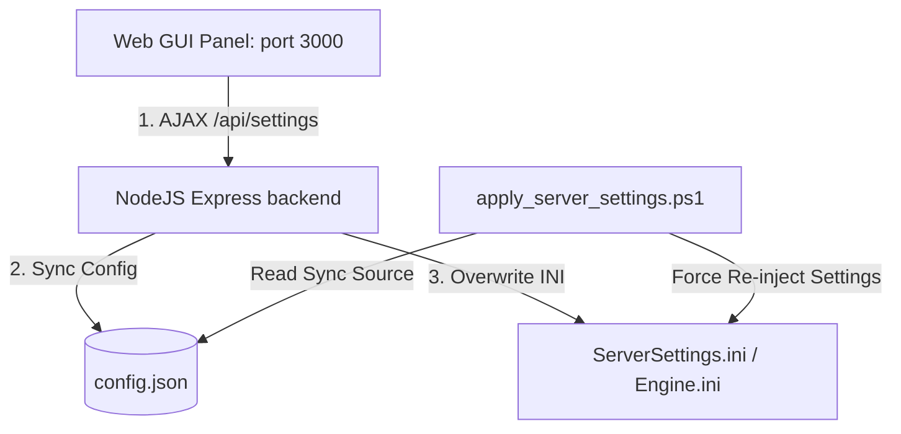

# ⚡ SCUM Dedicated Server Management Web GUI Panel

<p align="center">
  
  
  
  
</p>

---

## 🌐 Language Selectors / 언어 선택

* [🇰🇷 한국어 가이드](#-한국어-korean)
* [🇺🇸 English Guide](#-english)
* [🇯🇵 日本語ガイド](#-日本語-japanese)
* [🇨🇳 中文指南](#-中文-chinese)
* [🇷🇺 Руководство (Русский)](#-русский-russian)

---

## 🇰🇷 한국어 (Korean)

스컴 Dedicated Server의 원클릭 자동 설치, 하드웨어 성능 격리 구동, RCON 리모트 제어 및 실시간 텔레포트 좌표 분석 연동을 지원하는 다국어 고성능 관리 웹 GUI 대시보드 솔루션입니다.



### 📂 프로젝트 아키텍처 구조
```text
d:\scum_server
├── run_web_panel.exe        <- 마스터 런처 (콘솔 창 없는 백그라운드 윈도우 그래픽 바이너리)
├── build_project.bat       <- 프론트 빌드 및 배포 패키지(release/) 일괄 구성기
├── start_scum_server.bat    <- CPU 격리 구동 배치 스크립트 (코어 0~3 격리)
├── update_scum_server.bat   <- SteamCMD 연동 비대화식 게임 다운로드 스크립트
├── apply_server_settings.ps1<- config.json 기반 설정 주입 파워셸 (하드코딩 제거)
├── config.json              <- RCON 패스워드 및 경로 매핑 마스터 데이터 파일
├── docs/                    <- Ryzex 5800X / 64GB 자원 가이드 및 가비지 최적화 문서
└── release/                 <- 구동에 필요한 정제 파일만 모아둔 단독 배포 폴더
```

### ⚙️ 시스템 네트워크 포트 사양
| 포트 (Port) | 프로토콜 (Protocol) | 용도 (Description) | 바인딩 규칙 (Binding Rule) |
| :--- | :--- | :--- | :--- |
| **7777** | UDP | 메인 게임 세션 포트 (Game Port) | 스컴 클라이언트 접속용 |
| **7779** | UDP | 스팀 쿼리 포트 (Query Port) | 서버 목록 리스트 갱신 |
| **7777** | TCP | RCON 제어 포트 (Remote Control) | RCON WebSocket 콘솔 연동 |
| **3000** | TCP | 대시보드 호스트 포트 (Web GUI Host) | 웹 브라우저 관리 접속 포트 |

> [!IMPORTANT]
> 본 서버 패널은 Ryzen 5800X (8코어 16스레드) 및 64GB RAM 환경에서 동시 직접 플레이 시 발생하는 프레임 드랍을 막기 위해 **서버를 0~3번 물리 스레드(Affinity F)로 격리 할당**하고, 클라이언트(게임 플레이)에 나머지 4~15번 스레드를 독점 배칭하도록 자동 튜닝되어 있습니다.

### ⚡ 실행 및 구동 가이드
1. 최상위 루트 디렉터리의 **[run_web_panel.exe](file:///d:/scum_server/run_web_panel.exe)**를 실행합니다.
2. 실행과 동시에 브라우저가 자동 개방되며 `http://localhost:3000` 관리 화면으로 연결됩니다 (백엔드는 창이 뜨지 않는 서비스 모드로 구동됩니다).
3. **최초 설치 시**: 대시보드 하단의 **스팀 CMD 자동 다운로드 및 구성**을 클릭하면, SteamCMD 도구를 자동으로 획득하고 다운로드를 대기합니다.
4. **설정 주입**: 인게임 설정을 제어한 뒤 '설정 저장'을 누르면 설정 파일에 즉시 주입되며, 수동 주입 시 [apply_server_settings.ps1](file:///d:/scum_server/apply_server_settings.ps1)을 구동해도 안전하게 동기화 주입됩니다.

> [!TIP]
> 언리얼 엔진 가비지 컬렉터로 인한 순간 렉(stuttering)을 방지하도록 `gc.CreateGarbageCollectorUObjectClusters=True` 및 액터 클러스터링이 백그라운드 `Engine.ini`에 기본 튜닝되어 적용됩니다.

---

## 🇺🇸 English

A high-performance multilingual Web GUI dashboard solution for SCUM Dedicated Server. Features automated installations, CPU affinity isolation to avoid player-host stuttering, real-time WebSocket RCON terminal integration, and an interactive teleport coordinate map.

### 📂 Directory Architecture
Refer to the [Korean Structure Section](#-프로젝트-아키텍처-구조) for the directory layout.

### ⚙️ Dedicated System Network Ports
| Port | Protocol | Purpose | Details |
| :--- | :--- | :--- | :--- |
| **7777** | UDP | Main Game Port | Connection port for SCUM game clients. |
| **7779** | UDP | Steam Query Port | Updates the server lobby list. |
| **7777** | TCP | RCON Control Port | Receives remote WebSocket console commands. |
| **3000** | TCP | GUI Host Port | Web browser admin panel port. |

> [!IMPORTANT]
> To support host-side gaming resource protection (Ryzen 5800X / 64GB RAM), the server executable is dynamically pinned to **CPU threads 0-3 (Affinity F)**, leaving threads 4-15 dedicated to the gaming client to prevent gaming framerate hitching.

### ⚡ Operational Guide
1. Launch **[run_web_panel.exe](file:///d:/scum_server/run_web_panel.exe)** at the root path.
2. The browser automatically navigates to `http://localhost:3000` while the backend runs silently in the background.
3. **Initial setup**: Click **⚙️ Auto-Download & Install SteamCMD** to download and expand the SteamCMD package automatically.
4. **Synchronized settings**: Changing variables in the GUI updates the ini files and commits data to [config.json](file:///d:/scum_server/config.json) concurrently, preserving unified configs even if run via command line.

---

## 🇯🇵 日本語 (Japanese)

SCUM 専用サーバー向けの高機能多言語 Web GUI ダッシュボード。ワンクリックでのツールセットアップ、ホストの同時ゲームプレイを保護するCPU割り当て制限、リアルタイム RCON 操作、テレポート用座標計算グリッドなどを提供します。

### 📂 プロジェクトの構造
フォルダ構成は [韓国語セクション](#-프로젝트-아키텍처-구조) を参照してください。

### ⚙️ ネットワークポートマッピング
| ポート | プロトコル | 用途 | 説明 |
| :--- | :--- | :--- | :--- |
| **7777** | UDP | ゲームポート | SCUM クライアントの接続ポート |
| **7779** | UDP | クエリポート | Steam サーバーリストの更新用 |
| **7777** | TCP | RCON ポート | コマンド受信用 WebSocket ポート |
| **3000** | TCP | パネルポート | 管理 Web 画面接続用ポート |

> [!IMPORTANT]
> ホストPCでの快適な同時ゲームプレイ（Ryzen 5800X / 64GB）を保証するため、サーバープロセスは **CPUスレッド 0〜3 (Affinity F)** に割り当てが制限され、ゲームクライアント用に残り 4〜15 スレッドを確保します。

### ⚡ 運用マニュアル
1. ルートフォルダにある **[run_web_panel.exe](file:///d:/scum_server/run_web_panel.exe)** を起動します。
2. コマンドプロンプト画面を生成させず、バックグラウンドプロセスとして起動し、自動的に `http://localhost:3000` にアクセスします。
3. **初期設定**: 画面の下部にある **SteamCMD 自動ダウンロードと展開** をクリックしてセットアップを完了させます。
4. **設定同期化**: パネルから編集を行うと、各種 ini と [config.json](file:///d:/scum_server/config.json) に同時保存され、どの実行プロセスからでも整合性が保たれます。

---

## 🇨🇳 中文 (Chinese)

适用于 SCUM 专用服务器的高性能多语言 Web GUI 控制面板。支持一键式 SteamCMD 安装部署、游戏平衡参数热修改、CPU 亲和力限制以保障同机游戏流畅度、实时 RCON 控制台指令发送以及地图传送绝对坐标解析。

### 📂 项目目录结构
目录列表请参见 [韩语部分](#-프로젝트-아키텍처-구조)。

### ⚙️ 专用系统网络端口
| 端口 (Port) | 协议 (Protocol) | 用途 (Purpose) | 细节 (Details) |
| :--- | :--- | :--- | :--- |
| **7777** | UDP | 游戏主端口 | 游戏客户端连接端口 |
| **7779** | UDP | 创意工坊查询端口 | 更新服务器大厅列表 |
| **7777** | TCP | RCON 控制端口 | 接收远程 WebSocket 控制台命令 |
| **3000** | TCP | 控制面板主端口 | 浏览器访问管理面板端口 |

> [!IMPORTANT]
> 为保障同机游戏资源的流畅运行 (Ryzen 5800X / 64GB RAM)，服务器程序已被自动锁定在 **CPU 线程 0-3 (Affinity F)** 上运行，保留 4-15 线程供游戏客户端独占使用，从源头上杜绝联机卡顿。

### ⚡ 运行使用指南
1. 运行根目录下的 **[run_web_panel.exe](file:///d:/scum_server/run_web_panel.exe)**。
2. 系统会自动调用默认浏览器打开网页 `http://localhost:3000`，后台以无窗口形式静默运行。
3. **首次部署**: 点击控制台选项卡下方的 **⚙️ 自动下载并配置 SteamCMD**，全自动配置运行环境。
4. **数据同步**: 在控制面板上所做的所有配置均会直接修改 ini 配置文件，并同步保存至 [config.json](file:///d:/scum_server/config.json) 作为单源信任（Single Source of Truth）。

---

## 🇷🇺 Русский (Russian)

Высокопроизводительное веб-решение для управления выделенным сервером SCUM с поддержкой нескольких языков. Включает автоматическую установку SteamCMD, изоляцию ядер процессора для предотвращения зависаний хоста, RCON-терминал через WebSocket и интерактивный парсер координат для телепортации.

### 📂 Структура каталогов
Смотрите древовидную схему каталогов в [разделе на корейском языке](#-프로젝트-아ки텍처-구조).

### ⚙️ Сетевые порты выделенного сервера
| Порт | Протокол | Назначение | Описание |
| :--- | :--- | :--- | :--- |
| **7777** | UDP | Игровой порт | Подключение игровых клиентов SCUM |
| **7779** | UDP | Стим-порт запросов | Обновление списка лобби серверов |
| **7777** | TCP | RCON-порт | Удаленный доступ через WebSocket консоль |
| **3000** | TCP | Хост-порт GUI | Порт для доступа к админ-панели |

> [!IMPORTANT]
> Для стабильной игры на хост-компьютере (Ryzen 5800X / 64 ГБ ОЗУ) исполняемый файл сервера жестко привязывается к **потокам процессора 0-3 (Affinity F)**. Потоки с 4 по 15 остаются выделенными для игрового клиента.

### ⚡ Руководство по эксплуатации
1. Запустите файл **[run_web_panel.exe](file:///d:/scum_server/run_web_panel.exe)** в корневом каталоге.
2. Программа запустит бэкенд в скрытом режиме и автоматически откроет веб-панель по адресу `http://localhost:3000`.
3. **Первоначальная настройка**: Нажмите **⚙️ Автозагрузка и настройка SteamCMD** для загрузки и распаковки всех необходимых утилит.
4. **Синхронизация параметров**: Сохранение конфигурации в веб-интерфейсе перезаписывает ini-файлы и параллельно фиксирует новые переменные в [config.json](file:///d:/scum_server/config.json).
